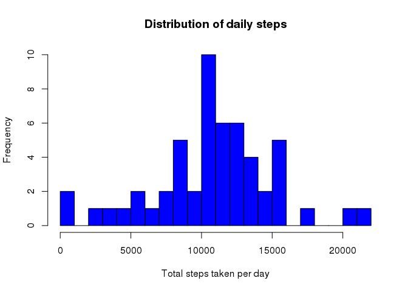
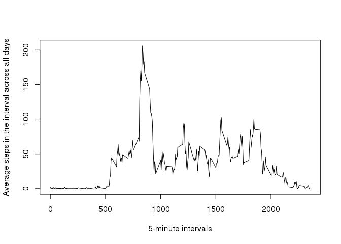
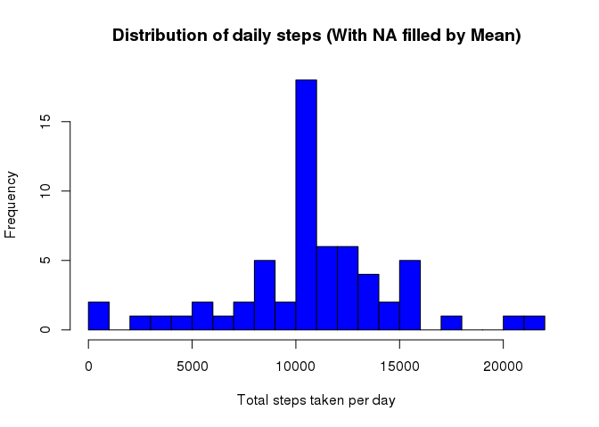

# Reproducible Research: Peer Assessment 1


## Loading and preprocessing the data
First step is to load the data file “activity.csv” by read.csv

```r
rawdata <- read.csv("activity.csv", head=TRUE)
head(rawdata)
```

```
##   steps       date interval
## 1    NA 2012-10-01        0
## 2    NA 2012-10-01        5
## 3    NA 2012-10-01       10
## 4    NA 2012-10-01       15
## 5    NA 2012-10-01       20
## 6    NA 2012-10-01       25
```
Next, pre-process the date for later analysis.   

1. Convert the date column to a date type  
2. Remove observation whose step variable is 'NA'  

```r
rawdata$date <- as.Date(rawdata$date)
data <- subset(rawdata, subset=(!is.na(rawdata$steps)))
head(data)
```

```
##     steps       date interval
## 289     0 2012-10-02        0
## 290     0 2012-10-02        5
## 291     0 2012-10-02       10
## 292     0 2012-10-02       15
## 293     0 2012-10-02       20
## 294     0 2012-10-02       25
```
## What is mean total number of steps taken per day?
Find the sum of steps grouped by date. 
Filter the result for NA values. 
Plot the histogram of total number steps by date

```r
dailysum <- tapply(data$steps, data$date, sum, na.rm=TRUE, simplify=T)
dailysum <- dailysum[!is.na(dailysum)]

hist(x=dailysum,
     col="blue",
     breaks=30,
     xlab="Total steps taken per day",
     ylab="Frequency",
     main="Distribution of daily steps")
```

 
Calculate the mean of total steps per day

```r
mean(dailysum)
```

```
## [1] 10766.19
```
Calculate the median of total steps per day

```r
median(dailysum)
```

```
## [1] 10765
```

## What is the average daily activity pattern?
1.Make a time series plot (i.e. type = "l") of the 5-minute interval (x-axis) and the average number of steps taken, averaged across all days (y-axis)   

First find the mean of steps grouped by interval. Next, reassign the result to a two column data frame for plotting.  


```r
act_avg <- tapply(data$steps, data$interval, mean, na.rm=TRUE, simplify=T)

daily_activity <- data.frame(interval=as.integer(names(act_avg)), avg=act_avg)

with(daily_activity,
     plot(interval,
          avg,
          type="l",
          xlab="5-minute intervals",
          ylab="Average steps in the interval across all days"))
```

 

2. Which 5-minute interval, on average across all the days in the dataset, contains the maximum number of steps?  
  
First find the max value of average steps. Next subset the data frame rows whose avg column value equals the max value


```r
max_steps <- max(daily_activity$avg)
daily_activity[daily_activity$avg == max_steps, ]
```

```
##     interval      avg
## 835      835 206.1698
```

## Imputing missing values

1.Calculate and report the total number of missing values in the dataset (i.e. the total number of rows with NAs)  


```r
sum(is.na(rawdata$steps))
```

```
## [1] 2304
```

2.Devise a strategy for filling in all of the missing values in the dataset. The strategy does not need to be sophisticated. For example, you could use the mean/median for that day, or the mean for that 5-minute interval, etc.  
  
Strategy here is to fill the NA fields with mean of steps for the given interval. First find the mean of steps grouped by interval. Next find the vector that has TRUE/FALSE in indexes corressponding to NA values.


```r
int_avg <- tapply(rawdata$steps, rawdata$interval, mean, na.rm=TRUE, simplify=T)
na_index <- is.na(rawdata$steps)
```

3. Create a new dataset that is equal to the original dataset but with the missing data filled in.  
  
Create a new dataset and fill the NA indexes with the mean values for the given  interval


```r
data_filled <- rawdata
data_filled$steps[na_index] <- int_avg[as.character(data_filled$interval[na_index])]
```

4.Make a histogram of the total number of steps taken each day and Calculate and report the mean and median total number of steps taken per day. Do these values differ from the estimates from the first part of the assignment? What is the impact of imputing missing data on the estimates of the total daily number of steps?  
  

```r
new_dailysum <- tapply(data_filled$steps, data_filled$date, sum, na.rm=TRUE, simplify=T)

hist(x=new_dailysum,
     col="blue",
     breaks=30,
     xlab="Total steps taken per day",
     ylab="Frequency",
     main="Distribution of daily steps (With NA filled by Mean)")
```

 

Calculate the mean of total steps per day (With NA filled by Mean)

```r
mean(new_dailysum)
```

```
## [1] 10766.19
```

Calculate the median of total steps per day (With NA filled by Mean)

```r
median(new_dailysum)
```

```
## [1] 10766.19
```
## Are there differences in activity patterns between weekdays and weekends?
1. Create a new factor variable in the dataset with two levels – “weekday” and “weekend” indicating whether a given date is a weekday or weekend day.  


```r
#function to find whether a day is weekend or weekday
is_weekday <- function(d) {
    wd <- weekdays(d)
    ifelse (wd == "Saturday" | wd == "Sunday", "weekend", "weekday")
}

wd <- sapply(data_filled$date, is_weekday)
data_filled$wd <- as.factor(wd)
head(data_filled)
```

```
##       steps       date interval      wd
## 1 1.7169811 2012-10-01        0 weekday
## 2 0.3396226 2012-10-01        5 weekday
## 3 0.1320755 2012-10-01       10 weekday
## 4 0.1509434 2012-10-01       15 weekday
## 5 0.0754717 2012-10-01       20 weekday
## 6 2.0943396 2012-10-01       25 weekday
```

2.Make a panel plot containing a time series plot (i.e. type = "l") of the 5-minute interval (x-axis) and the average number of steps taken, averaged across all weekday days or weekend days (y-axis). 
  

```r
wd_data <- aggregate(steps ~ wd+interval, data=data_filled, FUN=mean)

library(lattice)
xyplot(steps ~ interval | factor(wd),
       layout = c(1, 2),
       xlab="Interval",
       ylab="Number of steps",
       type="l",
       lty=1,
       data=wd_data)
```

 
